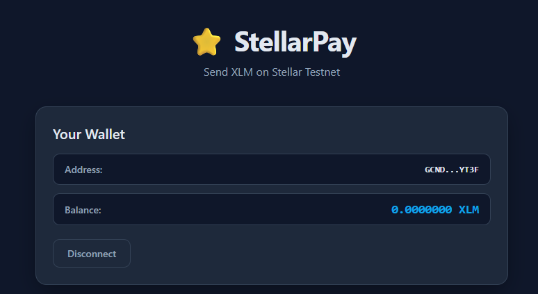
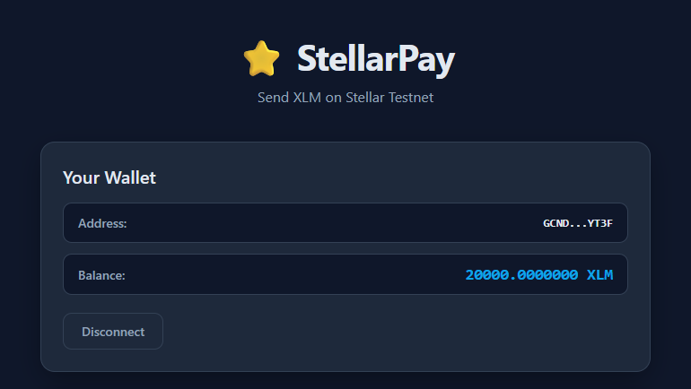
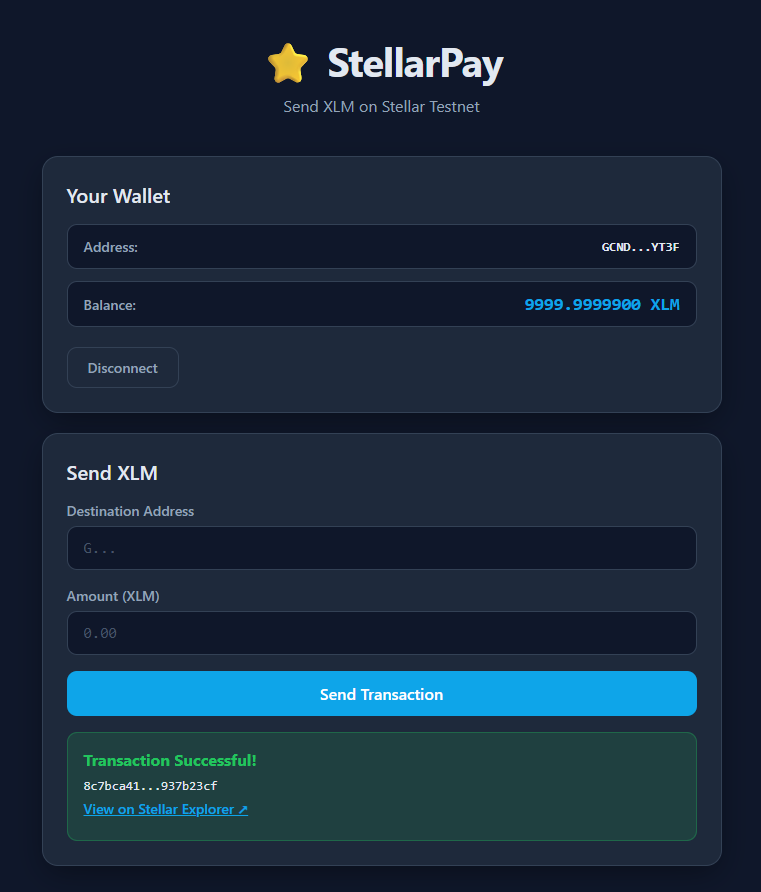

# StellarPay - Simple Payment dApp

A minimal, fully functional Stellar dApp for sending XLM on the Stellar Testnet. Built with React + Vite, integrated with the Freighter wallet.

## Project Description

StellarPay is a simple payment dApp that demonstrates the core fundamentals of Stellar development:

- **Wallet Connection**: Connect and disconnect Freighter wallet on Stellar Testnet
- **Balance Display**: View your wallet's XLM balance in real-time
- **Send XLM**: Send testnet XLM to any Stellar address
- **Transaction Feedback**: See success/failure states with transaction hashes

## Tech Stack

- **Frontend**: React 19 + Vite
- **Wallet**: Freighter Wallet (`@stellar/freighter-api`)
- **Blockchain**: Stellar SDK (`@stellar/stellar-sdk`)
- **Network**: Stellar Testnet

## Prerequisites

- Node.js >= 18
- [Freighter Wallet](https://freighter.app/) browser extension
- A Stellar Testnet account (get one at [Stellar Laboratory](https://laboratory.stellar.org/#account-creator?network=public))

## Setup Instructions

1. Clone the repository:
```bash
git clone https://github.com/YOUR_USERNAME/stellar-frontend-challenge.git
cd stellar-frontend-challenge
```

2. Install dependencies:
```bash
cd stellar-frontend-challenge
npm install
```

3. Start the development server:
```bash
npm run dev
```

4. Open http://localhost:5173 in your browser.

5. Make sure Freighter Wallet is installed and set to Testnet mode.

6. Click "Connect Freighter" to connect your wallet.

## Project Structure

```
stellar-frontend-challenge/
├── src/
│   ├── utils/
│   │   └── stellar.js       # Stellar SDK & Freighter API helpers
│   ├── App.jsx              # Main app component
│   ├── App.css              # App styles
│   ├── index.css            # Global styles
│   └── main.jsx             # React entry point
├── index.html
├── package.json
└── vite.config.js
```

## Features

### Wallet Setup
- Freighter wallet integration on Stellar Testnet
- Network detection and validation

### Wallet Connection
- One-click connect via Freighter
- Disconnect functionality
- Persistent connection state on page reload

### Balance Handling
- Real-time XLM balance fetch from Stellar Horizon API
- Clean balance display with 7 decimal precision

### Transaction Flow
- Send XLM to any valid Stellar address
- Input validation (address format, amount, balance check)
- Freighter transaction signing
- Success/failure feedback with transaction hash
- Direct link to Stellar Explorer for transaction details

### Error Handling
- Wallet not installed / locked
- Insufficient balance
- Invalid destination address
- Network errors

## Testing on Testnet

1. Install [Freighter Wallet](https://freighter.app/) and switch to Testnet mode.
2. Create/fund a testnet account using [Stellar Laboratory Friendbot](https://laboratory.stellar.org/#friendbot?network=public).
3. Run `npm run dev` and open the app.
4. Connect your wallet and send a test transaction.

## Screenshots

### Wallet Connected State


### Balance Displayed


### Successful Testnet Transaction


## License

MIT
